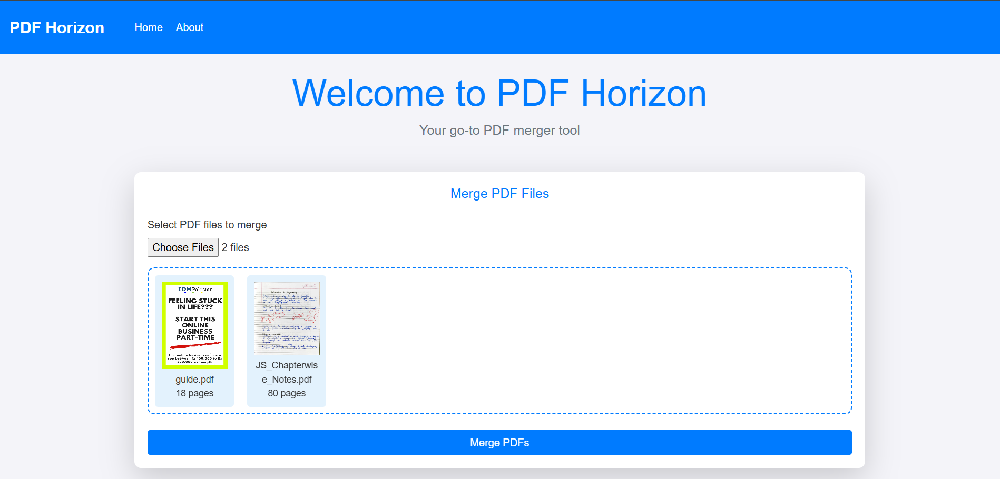

<h1 align="center">📄 PDF Horizon</h1>
<p align="center">Your all-in-one PDF companion for conversion, merging, splitting, and more!</p>

<div align="center">
  
  
</div>

---
👉 **Live Demo (if deployed):**  
[Visit PDF-Horizon Live](https://pdf-horizon-production.up.railway.app/)  


## 🚀 Features
✨ Convert PDFs to Word, Excel, and Images  
✨ Split large PDFs into smaller files  
✨ Add watermark or password protection  
✨ User-friendly UI with responsive design  
✨ Smooth animations & interactive components

## 🛠️ Tech Stack
- Node.JS
- Express.JS
- CSS (Bootstrap) ⭐

## 📸 Screenshots


## 📦 Setup
```bash
git clone https://github.com/HassaanMemon026/PDF-Horizon.git
cd PDF-Horizon
npm install
node server.js
```

## 💡 Inspiration
Designed to simplify all your PDF needs in one modern, stylish app.

## 🤝 Contributing
Feel free to fork and submit pull requests!

## 📄 License
This project is licensed under the MIT License.
